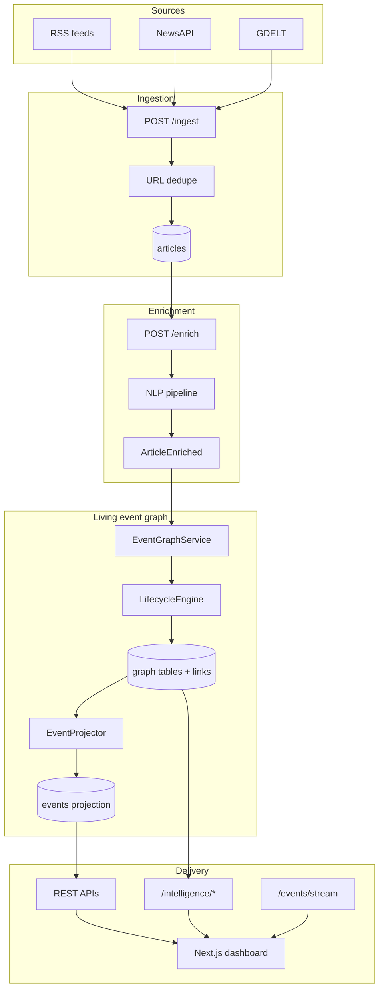
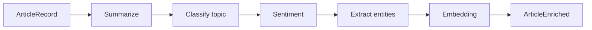
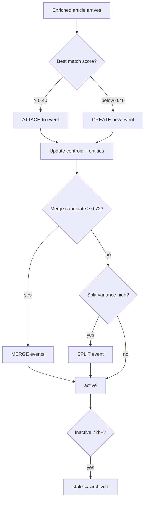
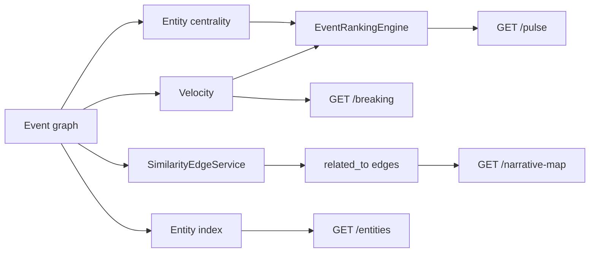
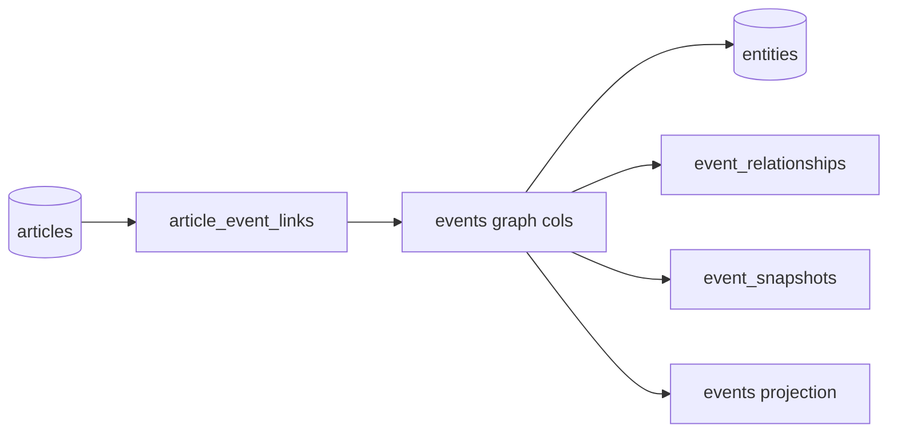

# CivicPulse AI — Architecture Diagrams

Visual reference for pipelines, graph mutations, intelligence pathways, and API surface.

For an interactive tabbed view in Cursor, open [`civicpulse-architecture.canvas.tsx`](civicpulse-architecture.canvas.tsx) as a Canvas beside the chat.

## End-to-end data pipeline

## NLP enrichment stages

Per article: summarize → classify topic → sentiment → extract entities → embed (`all-MiniLM-L6-v2`, 384-dim).

## Event graph lifecycle

Thresholds: attach **0.40** · merge **0.72** · stale **72h**

Mutations write to `article_event_links` and `event_relationships`. `EventProjector.reconcile()` materializes the read-optimized `events` table.

## Intelligence layer

### Pulse ranking weights

| Signal | Weight | Source |
|--------|--------|--------|
| Impact score | 25% | Article volume + source diversity |
| Velocity score | 30% | Non-linear article arrival rate |
| Recency | 20% | Hours since last update |
| Entity centrality | 15% | Connection density in entity graph |
| Source diversity | 10% | Distinct outlets covering event |

## PostgreSQL graph schema (v3)

Graph is source of truth; `events` table is the SQL projection.

## API routes

| Route | Purpose | Auth |
|-------|---------|------|
| `POST /ingest` | Fetch + dedupe articles | API key |
| `POST /enrich` | Run NLP on pending articles | API key |
| `POST /events/rebuild` | Graph sync + projection | API key |
| `GET /events` | Paginated event feed | Public |
| `GET /events/{id}` | Event + linked articles | Public |
| `GET /events/stream` | SSE live updates | Public |
| `GET /intelligence/pulse` | Ranked global pulse | Public |
| `GET /intelligence/breaking` | Accelerating stories | Public |
| `GET /intelligence/narrative-map` | Event nodes + edges | Public |
| `GET /intelligence/entities` | Top entities | Public |
| `GET /intelligence/entities/{name}` | Entity drill-down | Public |
| `POST /intelligence/strengthen-edges` | Rebuild similarity graph | API key |
| `POST /intelligence/sync` | Process unlinked articles | API key |

## Dashboard panels

| Panel | API | Behavior |
|-------|-----|----------|
| Global Pulse | `/intelligence/pulse` | Ranked events with velocity + centrality |
| Breaking Stories | `/intelligence/breaking` | Accelerating / new narratives |
| Entity Explorer | `/intelligence/entities` | Click entity → linked events |
| Narrative Map | `/intelligence/narrative-map` | `related_to` edge list |
| Event Feed | `/events` | Filterable card grid |
| Live stream | `/events/stream` | SSE connection indicator |
